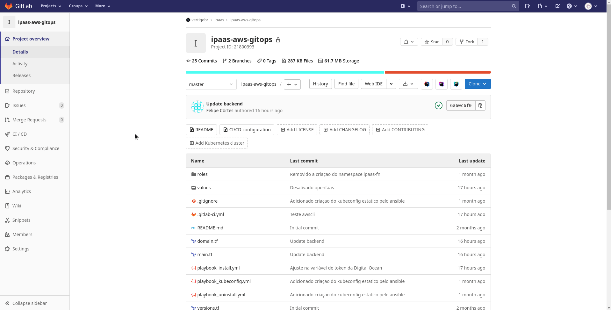
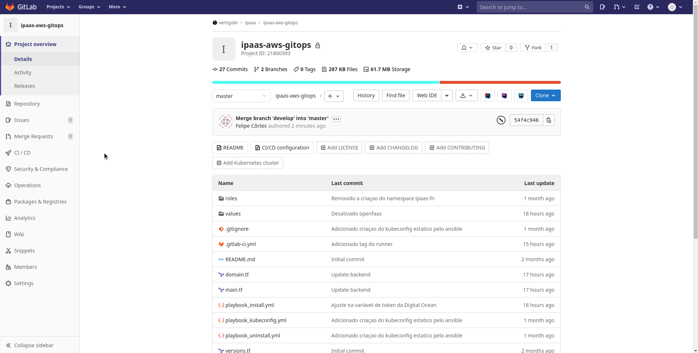

# GitOps | Amazon Web Services - EKS

O projeto GitOps é um template para provisionamento do cluster EKS na AWS.

## :rocket: Como usar

Para utilizar o template o usuário deve fazer o [fork deste repositório](https://gitlab.com/vkpr/devops/aws-eks/-/forks/new).

Após ser realizado o fork do repositório é necessário a configuração de três variável de ambiente no repositório, sendo elas: `AWS_ACCESS_KEY`, `AWS_SECRET_KEY` e `AWS_REGION`. Essas variável são o Access Key ID, Secret Access Key e a Região da AWS. Para saber como criar as chaves acesse a [documentação oficial](https://docs.aws.amazon.com/IAM/latest/UserGuide/id_credentials_access-keys.html#Using_CreateAccessKey).

Com as variáveis de ambiente definida no repositório já é possível executar a pipeline para provisionamento do cluster EKS, porém há uma configuração padrão de provisionamento localizada em [config/defaults.yml](config/defaults.yml) que pode ser alterada de acordo com a necessidade do usuário. Para saber todas as configurações possíveis acesse a [tabela detalhada](https://gitlab.com/vkpr/terraform-aws-eks/-/blob/master/README.md#user-content-inputs) do módulo.

### Pipeline

A pipeline é dividia em 5 jobs, sendo eles:
  - **Init:** Baixa todas as dependências necessárias para o provisionamento da infraestrutura.
  - **Validate:** Valida o código de provisionamento da infraestrutura.
  - **Build:** Gera o plano de execução de provisionamento da infraestrutura.
  - **Deploy (execução manual):** Provisiona a infraestrutura e disponibiliza o kubeconfig do cluster no `artifact` da pipeline para download.
  - **Destroy (execução manual):** Destrói a infraestrutura.

## :memo: Licença

[MIT](LICENSE)
